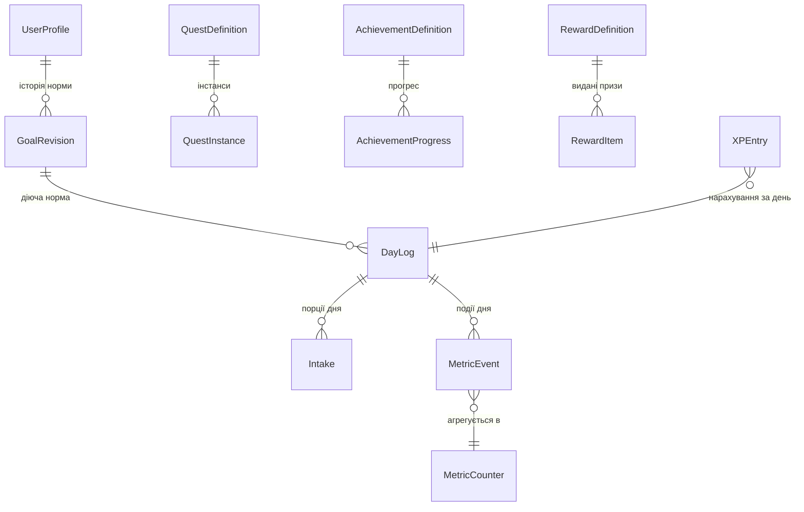

# 🗺️ План розробки iOS-додатку «Трекер води»

Документ описує, **як саме** буде вестися розробка: технічні рішення, архітектура, база даних,
модуль статистики, перенесення макетів і покроковий план з критеріями приймання.

Джерела: `SPEC-TEMPLATE.md` (ТЗ), `WaterTracker.html` (макети), `DESIGN-TOKENS.md` (витяг дизайну).

---

## 0. Мета етапу та межі

**Мета:** зробити повноцінно робочий **каркас** застосунку — модульний, з продуманою БД,
системою збору статистики, дизайн-системою і фундаментом тестів, у який далі легко
довкладати функціонал.

**У межах цього етапу переносимо 4 макети:**

| Макет | Екран | Роль у застосунку |
|---|---|---|
| **1a** | Головний («Сьогодні») | кільце прогресу, швидке додавання, завдання дня, історія + 5 шторок |
| **3f** | Прогрес / профіль | рівень і XP, нагорода за наступний рівень, завдання, призи, досягнення |
| **2e** | Досягнення | категорії + сітка плиток 3×N + модалка деталей |
| **4a** | Норма води / статистика | рівномірність, об'єм по днях, календар-теплокарта, деталі дня, типова доба, теплокарта часу |

**Поза межами етапу (свідомо):** онбординг (макети 5a–5f), сповіщення, віджети, Apple Watch,
HealthKit, монетизація, типи напоїв. Архітектура закладається так, щоб кожне з цього
підключалося окремим модулем без переписування ядра.

---

## 1. Технологічні рішення

| Питання | Рішення | Чому |
|---|---|---|
| Мова / UI | Swift 6, **SwiftUI** | макети — це кастомна графіка й анімації; UIKit тут нічого не дає |
| Мінімальна iOS | **17.0** | `@Observable`, SwiftData, інтерактивні віджети, `ContentUnavailableView`; покриття пристроїв ~95 % |
| Xcode-проєкт | новий, згенерований **XcodeGen** (`project.yml`) | проєкт-файл у Git читабельний, конфлікти в `.pbxproj` не виникають |
| Персистентність | **SwiftData** + шар репозиторіїв (`protocol`) | нативно, без залежностей; репозиторії дають змогу підмінити на GRDB, якщо агрегати стануть важкими |
| Архітектура | модулі — локальні **SPM-пакети**; всередині MVVM (`@Observable` ViewModel) + сервіси | вимога ТЗ про модульність; кожен модуль компілюється й тестується окремо |
| DI | простий контейнер `AppEnvironment` + протоколи на кожен сервіс | тести підставляють fake без магії |
| Залежності | **жодних сторонніх** у ядрі; `swift-snapshot-testing` — лише в тестових таргетах | контроль над бінарником, менше ризиків для App Store |
| Тести | XCTest (unit, per-package) + XCUITest (e2e) + snapshot-тести дизайну | вимога ТЗ «закласти основу для unit та e2e» |
| Локалізація | String Catalog (`.xcstrings`), базова `uk`, потім `en` | плюралізація українською працює з коробки |
| Час/дата | єдиний `Clock`-протокол + `CalendarService` (день починається о 00:00, локальний TZ) | інакше тести на стріки й добові розрізи неможливі |
| Аналітика використання | **немає** на цьому етапі (протокол `AnalyticsSink` — заглушка) | дані лишаються тільки на пристрої, як у ТЗ |

---

## 2. Архітектура модулів

```
WaterTrackerApp (app target)
│
├── Packages/Core            — Clock, CalendarService, Result-типи, DI, Logger, Units (мл ⇄ oz)
├── Packages/Persistence     — SwiftData-схема, репозиторії, міграції, фікстури/сідер
├── Packages/DesignSystem    — токени, шрифти, компоненти, графіки, прев'ю-галерея
├── Packages/Metrics         — шина подій + агрегати (серце статистики)
├── Packages/Hydration       — порції, денна ціль, правило 120 %, undo
├── Packages/Gamification    — XP/рівні, стріки, квести, досягнення, призи (4 незалежні движки)
├── Packages/Insights        — обчислення для 4a: рівномірність, медіана/розкид, теплокарти, тренд
└── Packages/Features        — HomeFeature (1a), ProgressFeature (3f), AchievementsFeature (2e), StatsFeature (4a)
```

Правила залежностей (перевіряються тестом на граф імпортів):

```
Features → (Hydration | Gamification | Insights) → Metrics → Persistence → Core
Features → DesignSystem → Core
```

Ніхто не імпортує `Features`; `DesignSystem` не знає про доменні моделі — приймає лише
прості view-моделі (`struct TaskRowModel`, `struct BarModel`…). Це дозволяє
викинути або замінити будь-який модуль гейміфікації без дотику до UI-компонентів.

**Ключ до модульності:** модулі спілкуються не викликами один одного, а через `Metrics` —
`HydrationService` публікує подію, а движки XP/квестів/досягнень на неї реагують.
Додавання нової механіки = новий підписник, без правок у `Hydration`.

---

## 3. Модель даних

### 3.1 Діаграма



### 3.2 Таблиці

**`UserProfile`** (один рядок)
`id, createdAt, gender?, birthYear?, weightKg?, activityLevel, climate, unitSystem (ml|oz),
onboardingCompleted, themeMode (system|light|dark), hapticsEnabled, soundEnabled, locale`

**`GoalRevision`** — норма змінюється з часом, статистика має рахуватись за нормою, що діяла тоді
`id, effectiveFrom (date), goalMl, source (calculated|manual), inputsSnapshot (JSON: вага/активність/клімат), createdAt`
· індекс: `effectiveFrom DESC` · правило: мін. 500 / макс. 5000 мл.

**`DayLog`** — денний агрегат (щоб не рахувати графіки по сирих порціях)
`id, dayKey (yyyy-MM-dd, локальний), goalMlSnapshot, totalMl, countedMl (з урахуванням стелі 120 %),
completionPct, goalMet (bool), entriesCount, firstIntakeAt?, lastIntakeAt?, timeZoneId, closedAt?`
· унікальний індекс: `dayKey`.

**`Intake`** — порція
`id, dayLogId (FK), amountMl, createdAt, source (app|widget|notification|siri|shortcut), deletedAt?`
· не редагується (ТЗ), видалення — soft-delete, щоб коректно відкотити XP
· обмеження: 50…2000 мл за одну порцію (антифрод/нереалістичний об'єм)
· індекси: `(dayLogId, createdAt DESC)`.

**`MetricEvent`** — сира подія (ядро статистики)
`id, name (enum-key), occurredAt, dayKey, hourBucket (0…23), value (Double), payload (JSON), sourceRef (UUID?)`
· індекси: `(name, dayKey)`, `(dayKey, hourBucket)`.

**`MetricCounter`** — згорнутий агрегат для швидких перевірок
`id, metricKey, periodType (day|week|month|year|all), periodKey, sum, count, min, max, lastUpdatedAt`
· унікальний індекс: `(metricKey, periodType, periodKey)`.

**`StreakState`** (один рядок)
`currentStreak, longestStreak, lastCountedDayKey, freezeTokens, lastFreezeUsedDayKey, updatedAt`

**`XPEntry`** — журнал досвіду (дає чесний undo)
`id, amount, multiplier, reason (intake|questDone|achievement|dailyGoal|partOfDay|prize|streakBonus),
refId (UUID?), dayKey, createdAt, revertedAt?`
· поточні `totalXp` і `level` — обчислювані з журналу + кешуються в `LevelState`.

**`LevelState`** (кеш) `level, totalXp, xpIntoLevel, xpForNextLevel, updatedAt`

**`QuestDefinition`** (каталог у коді/JSON, версіонований)
`key, scope (daily|weekly|adhoc), titleKey, metricKey, comparator, targetValue, rewardXp, rewardKey?, weight, minLevel`

**`QuestInstance`**
`id, defKey, periodKey, target, progress, state (active|completed|expired|claimed), assignedAt, expiresAt, completedAt?`
· унікальний індекс: `(defKey, periodKey)`.

**`AchievementDefinition`** (каталог) `key, titleKey, descKey, category (all|streak|volume|secret), metricKey, target, isSecret, rewardXp, icon`

**`AchievementProgress`** `id, defKey (unique), value, target, unlockedAt?, seenAt?`

**`RewardDefinition`** (каталог) `key, kind (theme|xpBonus|streakFreeze|questType|badge), titleKey, descKey, icon, levelRequired?`

**`RewardItem`** — видана нагорода / приз
`id, defKey, source (level|quest|achievement|random), acquiredAt, activatedAt?, expiresAt?, state (new|active|used)`

**`QuickAddPreset`** `id, order, amountMl, enabled` — 3 пресети (200/500/1000) + кнопка «Інше» (ТЗ: редаговані)

**`NotificationRule`** (готуємо структуру наперед, UI поки не робимо)
`id, kind (smart|fixed|adaptive|analysis), enabled, weekdayMask, fromHour, toHour, quietRanges (JSON)`

### 3.3 Правила цілісності

- Додавання/видалення порції — **одна транзакція**: `Intake` + перерахунок `DayLog` + `MetricEvent` + `XPEntry`.
- Стеля 120 %: `countedMl = min(totalMl, goal × 1.2)`; `totalMl` зберігає фактичне значення.
- Зміна норми серед дня → нова `GoalRevision`, `DayLog.goalMlSnapshot` оновлюється для **поточного** дня, минулі дні не чіпаються.
- Ролловер дня о 00:00 локального часу; при зміні TZ день визначається за `timeZoneId`, записаним у `DayLog`.
- Видалення застосунку = втрата даних (тільки on-device, без бекапу) — як у ТЗ.

---

## 4. Модуль статистики (`Metrics`)

Це саме та «система збору статистики, яку легко додати до будь-якого функціоналу», яку вимагає ТЗ.

```swift
// 1. Будь-який модуль публікує подію — і на цьому його обов'язки закінчуються
metrics.record(.init(name: .intakeAdded, value: 300, at: now, payload: ["source": "widget"]))

// 2. Metrics сам: пише MetricEvent → оновлює MetricCounter → шле в шину
// 3. Підписники (XP, квести, досягнення, інсайти) реагують незалежно один від одного
```

**Реєстр метрик** (`MetricKey`) — єдине джерело правди, з якого живляться і завдання, і досягнення, і графіки:

`intake.added`, `intake.removed`, `intake.count`, `day.total`, `day.goalMet`, `day.completionPct`,
`part.morning|noon|day|evening|night`, `streak.current`, `xp.earned`, `level.reached`,
`quest.completed`, `achievement.unlocked`, `app.opened`, `prize.activated`, `reminder.responded`.

Властивості модуля:
- **Ідемпотентність:** подія з тим самим `sourceRef` не подвоює агрегат.
- **Реверс:** `metrics.revert(sourceRef:)` — відкат події і всіх похідних (потрібно для undo порції).
- **Реплей:** агрегати можна перебудувати з `MetricEvent` (`rebuildCounters()`), це ж використовується в тестах.
- **Декларативні правила:** квести й досягнення — це `metricKey + comparator + target`, тобто нова умова додається рядком у каталог, без коду.

---

## 5. Гейміфікація (4 незалежні движки)

| Движок | Відповідальність | Ключове правило |
|---|---|---|
| `XPEngine` | нарахування/відкат XP, рівні | усе через `XPEntry`; рівень = f(totalXp); формула зростання — **`xpToNext(n) = 100 + 50·(n−1)` (лінійна з наростанням)**, винесена в `LevelCurve`-протокол |
| `StreakEngine` | серія днів, множник XP, заморозка | день зараховується при 100 % норми; заморозка витрачає `RewardItem(kind: .streakFreeze)` |
| `QuestEngine` | видача/прогрес/закриття завдань | інстанси на `periodKey`; прогрес — читання `MetricCounter` |
| `AchievementEngine` | розблокування досягнень | те саме джерело метрик; секретні — прапорець `isSecret` |

**Відкат дії (питання з ТЗ, розділ 5.2).** Пропоноване рішення: **повний реверс** —
видалення порції відкочує XP, знімає квест у стан `active` і знімає досягнення,
якщо воно розблокувалось саме цією подією (`XPEntry.refId` / `AchievementProgress.unlockedAt` порівнюються з `sourceRef`).
Виняток: якщо після відкату умова все одно виконана з інших даних — досягнення лишається.
Це чесно і не дає «фармити» видаленням. Рішення інкапсульоване в `RevertPolicy` — змінити його потім = один файл.

---

## 6. Перенесення макетів: метод

1. **Токени.** Спершу `DesignSystem` (див. `DESIGN-TOKENS.md`) — кольори, шрифти, радіуси, тіні, анімації.
   Шрифти Fredoka + Nunito бандлимо (OFL), реєструємо через `UIAppFonts`.
2. **Компоненти.** Кожен елемент з інвентарю — окремий `View` з `#Preview` (light + dark).
3. **Екрани.** Складання екрана з готових компонентів; жодних «магічних чисел» у Feature-шарі —
   тільки токени й компоненти.
4. **Дизайн-QA.** Окремий debug-таргет `DesignGallery`: рендерить кожен екран з тими самими
   фікстурами, що в макеті (ml = 1250, goal = 2000, streak = 12, level = 7, xp = 320/500,
   історія 300/200/500/250, липень 2026, сьогодні = 18). Порівняння скріншот-у-скріншот з HTML
   при ширині 402 pt. Розбіжність > 1 pt у розмірі/відступі — баг.
5. **Snapshot-тести** фіксують результат, щоб дизайн не «поплив» при рефакторингу.

**Точність:** макети зроблені в кадрі 402 × 874 pt, тому всі числа з HTML переносяться 1:1.
Динамічний шрифт обмежуємо (`.dynamicTypeSize(...DeviceSize.accessibility1)`) — інакше макет ламається;
повну підтримку Dynamic Type виносимо в окрему задачу після MVP.

---

## 7. Екрани: розбір і джерела даних

### 7.1 Макет 1a — Головний

| Блок | Компонент | Дані | Дія |
|---|---|---|---|
| Хедер: шестерня | `WTCircleButton` 42 | — | шторка «Налаштування» |
| Хедер: 7 крапок | `WeekDotsRow` | `DayLog` за поточний тиждень | (тап → шторка стріку/календаря) |
| Хедер: крапля з рівнем | `LevelDropIcon` + бейдж | `LevelState`, `hasNewAch` | перехід на **3f** |
| Кільце 242 pt | `ProgressRing` | `DayLog.countedMl / goal` | — |
| 4 кнопки | `QuickAddGrid` | `QuickAddPreset` | +200 / +500 / +1000 / шторка «Інше» |
| Завдання на сьогодні | `TaskRow` × N | `QuestInstance(scope: .daily)` | — |
| Історія | `HistoryTimelineRow` × N | `Intake` за день | тап → розкрити «Видалити» |
| Шторка «Інше» | `WTSheet` | крок 50, чіпи 150/250/350/500 | додати порцію |
| Шторка календаря | `WTSheet` | `DayLog` місяця, `streak` | — |
| Шторка налаштувань | `WTSheet` | ціль (крок 250), нагадування, темна тема | зберегти |
| Шторка статистики | `WTSheet` | 7 днів + середнє/найкращий/разом | — |
| Шторка досягнень | `WTSheet` | `AchievementProgress` (сітка 2×N) | — |

Тема перемикається тут же (`themeMode`) — обидві палітри вже є в макеті.

### 7.2 Макет 3f — Прогрес

Донат рівня (тап → шторка «Нагороди за рівні» зі списком 1…12 і XP-баром) → блок «НАГОРОДА НА РІВНІ N»
→ «ЗАВДАННЯ» (сьогодні / цього тижня) → «ПРИЗИ» з кнопкою «Активувати» → «ДОСЯГНЕННЯ» 4×N
з кнопкою «Всі» → перехід на **2e**.
Дані: `LevelState`, `XPEntry`, `QuestInstance`, `RewardItem`, `AchievementProgress`, `RewardDefinition`.

### 7.3 Макет 2e — Досягнення

Кільце прогресу «N/M» → таби категорій («Всі / Стріки / Об'єм» — з `AchievementDefinition.category`)
→ сітка плиток 3×N (закриті — з прогрес-баром і `val/target`) → модалка з описом і статусом.

### 7.4 Макет 4a — Норма води / Статистика

| Блок | Обчислення (модуль `Insights`) |
|---|---|
| «Рівномірність за день», бал 0–100 | 5 частин доби; смуга = випито, ризка = `goal / 5`; бал — нормована відстань від ідеального розподілу (формула фіксується в `EvennessScore`, покрита unit-тестами) |
| «Об'єм по днях» (7 днів / 8 тижнів) | суми `DayLog`, пунктир цілі, автомасштаб від `max(значення, ціль)` |
| «Календар пиття» | теплокарта % норми, галочка при ≥ 100 %, свайп ±1 місяць, межа — місяць встановлення |
| Деталі обраного дня | ритм по 5 частинах доби + список внесень (без видалення) |
| «Типова доба — медіана і розкид» | перемикач 7 / 30 днів; медіана частки періоду, міжквартильний розкид, ризка цілі + інфо-модалка |
| «Коли ти п'єш» | теплокарта 7 днів × 9 годинних бакетів (6…22), 5 рівнів інтенсивності |
| Шторка «Розрахунок норми» | вага (крок 1 кг), активність (3), клімат (2) → рекомендована норма → «Застосувати» |

---

## 8. Навігація

`NavigationStack` + власні шторки (не системні — макет має нестандартні радіус/тінь/анімацію).

```
Home (1a)
 ├─ шестерня        → шторка Налаштування
 ├─ крапля з рівнем → Progress (3f) ─ «Всі» → Achievements (2e)
 │                                  └ тап по донату → шторка «Нагороди за рівні»
 └─ тап по кільцю   → Stats (4a) ─ шторка «Розрахунок норми»
```

⚠️ Два переходи в макетах не мають явної кнопки — вони **дораховані** мною (позначено як припущення в §12):
вхід на **4a** (пропоную тап по кільцю прогресу) і виклик шторки «Розрахунок норми» на 4a
(пропоную рядок «Розрахувати норму» в налаштуваннях + кнопку в шапці 4a).
Таб-бару в макетах немає — навігацію лишаємо стековою.

---

## 9. Тести

| Рівень | Що покриваємо | Де |
|---|---|---|
| Unit — домен | формула норми, стеля 120 %, ролловер дня, зміна TZ, стріки й заморозка, XP + відкат, прогрес квестів і досягнень, ідемпотентність метрик | `Packages/*/Tests` |
| Unit — обчислення | бал рівномірності, медіана/розкид, бакети теплокарти, масштабування графіків, порожні дані | `InsightsTests` |
| Unit — БД | міграції, унікальні індекси, транзакційність «додав/видалив порцію», `rebuildCounters()` | `PersistenceTests` |
| Snapshot | усі компоненти + 4 екрани, light + dark, 402 × 874 | `DesignSystemTests` |
| E2E (XCUITest) | сценарії: додав 200 мл → % змінився → зʼявився в історії → видалив → % відкотився; виконання завдання → +XP; перехід 1a → 3f → 2e; перемикання теми; перегляд 4a з фікстурним місяцем | `WaterTrackerUITests` |

**Керованість тестів:** застосунок стартує з `--uitest-fixture <name>` — сідер наливає детерміновану БД
в in-memory сторі, `Clock` підмінюється фіксованою датою (18 липня 2026). Без цього e2e буде «плаваючим».

---

## 10. Етапи розробки

| # | Етап | Результат | Критерій приймання | Оцінка |
|---|---|---|---|---|
| **0** | Каркас проєкту | XcodeGen-проєкт, 8 SPM-пакетів, порожні тест-таргети, `Makefile` (build/test/lint), SwiftLint | `make test` зелений на порожніх тестах; граф залежностей відповідає §2 | 1 д |
| **1** | Дизайн-система | токени, шрифти, ~25 компонентів, `DesignGallery` | усі компоненти мають прев'ю light+dark; snapshot-база зафіксована | 3–4 д |
| **2** | Дані | SwiftData-схема §3, репозиторії, сідер, фікстури | unit-тести БД зелені; фікстура «липень 2026» наливається | 2–3 д |
| **3** | Metrics | події, лічильники, шина, revert + replay | тести на ідемпотентність і відкат; `rebuildCounters()` дає той самий результат | 2 д |
| **4** | Екран 1a | головний екран + 5 шторок, реальне додавання/видалення порцій | e2e «додав/видалив»; піксельне звіряння з макетом | 4–5 д |
| **5** | Гейміфікація | XPEngine, StreakEngine, QuestEngine, AchievementEngine + каталоги | тести правил і відкату; завдання на 1a живі | 3–4 д |
| **6** | Екран 3f | прогрес, призи, нагороди за рівні | звіряння з макетом; перехід на 2e | 2–3 д |
| **7** | Екран 2e | досягнення, категорії, модалка | звіряння; фільтри працюють на реальних даних | 1–2 д |
| **8** | Insights + екран 4a | усі 6 блоків статистики + шторка розрахунку | тести обчислень; звіряння; коректна поведінка на порожніх даних | 4–5 д |
| **9** | Зшивання й полірування | навігація, темна тема для 2e/3f/4a, локалізація `uk`, гаптика, порожні стани, продуктивність | e2e-набір зелений; немає хардкоду рядків; 60 fps на анімаціях | 2–3 д |

**Разом: ≈ 24–32 робочих дні** до готового каркаса з 4 екранами.

Далі (окремими етапами, поза цим планом): онбординг 5a–5f → сповіщення → віджети → Apple Watch.


---

## 🚦 Статус виконання (оновлено 25.08.2026)

| # | Етап | Стан | Що зроблено |
|---|---|---|---|
| **0** | Каркас проєкту | ✅ | XcodeGen (`project.yml`), 8 SPM-пакетів, `Makefile`, e2e-таргет |
| **1** | Дизайн-система | ✅ | токени, типографіка, 25+ компонентів, графіки, 7 тестів палітри |
| **2** | Дані | ✅ | 14 таблиць SwiftData, репозиторії, 12 тестів |
| **3** | Metrics | ✅ | події, лічильники, шина, revert + rebuild, 9 тестів |
| **4** | Екран 1a | ✅ | головний екран + 5 шторок, реальні порції й undo |
| **5** | Гейміфікація | ✅ | XP/рівні/серії/квести/досягнення/призи, 29 тестів |
| **6** | Екран 3f | ✅ | прогрес, нагороди рівнів, призи, досягнення |
| **7** | Екран 2e | ✅ | категорії, сітка 3×N, модалка |
| **8** | Insights + 4a | ✅ | 6 блоків статистики + калькулятор норми, 12 тестів |
| **9** | Зшивання й полірування | 🟡 | навігація, теми й e2e готові; лишились шрифти, локалізація в каталог |
| **10** | Відчуття та відгук | ✅ | гаптика з вимикачем, стани натискання, анімовані шторки + drag-to-dismiss, тост із «Скасувати» й тост рівня, пояснення стелі 120 %, Reduce Motion |

**Тести:** 113 unit (8 пакетів) + 9 e2e у симуляторі — усі зелені.
`make test-packages` — швидкий цикл без симулятора, `make test-ui` — e2e.

### Що з'ясувалося під час реалізації

1. **Продуктивність.** Перша версія витрачала 45 мс на одну порцію: `LevelState` перечитувався з
   усього журналу XP, а лічильники метрик — з БД по 40 вибірок на дію. Додано кеш рівня,
   лічильників, рядків досягнень і квестів + збереження контексту раз на дію (`metrics.commit()`).
   Стало **9 мс** — тест `PerformanceTests` тримає межу.
2. **Максимум лічильника не відкочується арифметично.** Досягнення «Великий ковток» (1 л за раз)
   лишалося відкритим після видалення тієї самої порції. Тепер `min`/`max` перечитуються з подій
   при відкаті.
3. **Рівні не видавали призи.** Каталог нагород був, але інвентар лишався порожнім —
   додано `grantLevelRewards` з ідемпотентною видачею за детермінованим ключем.
4. **Ідентифікатор доступності на контейнері перекриває дочірні.** Через це шторки були
   недосяжні для e2e: усі елементи успадковували `screen.home`. Ідентифікатори лишились
   тільки на конкретних елементах. *(Та сама пастка вдруге спрацювала на тості
   в етапі 10 — тепер про це є коментар у `WTToast`.)*

5. **`xcodebuild` писав збірку не туди, куди всі думали.** `make build` без
   `-derivedDataPath` кладе продукт у `~/Library/Developer/Xcode/DerivedData`, а тека
   `DerivedData/` у проєкті лишалась зі старою збіркою. Будь-який
   `find DerivedData -name '*.app'` віддавав дводенний бінарник, і в симулятор їхав код,
   якого в репозиторії вже не було. Через це «перевірка руками» показувала застосунок
   без щойно доданих можливостей, тоді як e2e (який будує сам) був зелений — і виглядало
   це як регресія в коді. Тепер `build` і `test-ui` пінять `-derivedDataPath DerivedData`,
   а `make install` ставить у симулятор саме той продукт.

6. **`waitForExistence` не є перевіркою видимості.** Він підтверджує лише наявність
   елемента в дереві доступності. Тост, застряглий за межею екрана, лишив би тест зеленим.
   У сценарії зі скасуванням додано `isHittable` і перевірку, що елемент у межах вікна.

7. **Шар відгуку був відсутній як клас.** Грепом по всьому дереву: нуль `sensoryFeedback`,
   два `withAnimation` на застосунок, нуль кастомних `ButtonStyle`, а токен `WTAnimation.sheet`
   не використовувався **жодного разу** — шторки мали `.transition`, але присвоєння
   `model.sheet = …` йшло повз `withAnimation`, тож перехід не програвався ніколи.

8. **Норма й новий рівень закриваються тією самою порцією.** Виконання норми дає більшість
   денного XP, тож ці дві події майже завжди збігаються. Візуального святкування норми немає
   (пробували — перевантажувало момент), лишились вібрація `.goalReached` і тост про рівень.

9. **`String.hashValue` не детермінований між запусками процесу.** `FixtureSeeder`
   вибирав патерн дня як `abs(dayKey.rawValue.hashValue) % …`, а Swift засіває хешування
   рядків випадково при старті процесу (якщо не виставлено `SWIFT_DETERMINISTIC_HASHING`).
   Доккоментар обіцяв «детерміновані демо-дані», але три однакові прогони з тим самим
   `FixedClock` давали серії 0, 2 і 1: скріншоти для дизайн-QA не збігалися між собою,
   e2e на вміст демо-історії були приречені плавати, а різні числа серії в шапці (8 і 9)
   породили хибний баг-репорт. Замінено на власний FNV-1a (`FixtureSeeder.stableHash`).
   Пропуск дня і вибір патерну тепер беруться з різних половин хешу — спільне джерело
   остач корелювало (9 і 6 мають дільник 3) і перекошувало частку днів із закритою нормою.
   Тест на дві бази в одному процесі таку регресію **не ловить** (усередині процесу
   `hashValue` стабільний), тому `FixtureSeederTests` прибиває самі числа хешу.

### Свідомі відхилення від макета

| Що | Як у макеті | Як зроблено | Чому |
|---|---|---|---|
| Шрифти | «Fredoka» на заголовках | Nunito на весь текст, Fredoka лише на числах | у макеті Fredoka підключена **без кирилиці** — український текст там і так рендериться Nunito (рішення 25.08.2026: гарнітури завантажено з Google Fonts і додано в бандл) |
| Розрахунок норми (шторка 4a) | є в макеті, без тригера | винесено у `GoalCalculatorSheet.swift`, не підключено | рішення 25.08.2026: норма змінюється лише в налаштуваннях, формула — пізніше. Верстка й доменна логіка (`GoalFormula`) збережені та покриті тестами |
| Ризка «ціль» у «Рівномірності» | однакова для всіх рядків (норма ÷ 5) | зважена за `DayPart.idealShare` | у сусідньому графіку «Типова доба» ризки теж різні; рівний поділ ставить ціль на ніч нарівні з днем |
| Бал рівномірності | зашите число 47 | формула `100 × (1 − ½·Σ\|факт − ідеал\|)` | у макеті це демо-значення, формули не було |
| Дані макетів (рівень 7, стрік 12) | зашиті | обчислюються з реальної історії | цифри тепер походять з БД, а не з констант |

### Наступні кроки

1. **Зміна доби при поверненні з фону:** `scenePhase` не обробляється ніде, тож застосунок,
   залишений відкритим на ніч, показує вчорашній день. Найближчий реальний баг.
2. **`services.revision`** пишеться, але його ніхто не читає — або зробити єдиним сигналом
   оновлення екранів, або прибрати.
3. **VoiceOver:** покриття нульове (є лише `accessibilityIdentifier` для e2e) — потрібні
   `accessibilityLabel` / `accessibilityValue` для кільця, кнопок, історії, календаря.
4. Локалізація: винести рядки в `.xcstrings` (зараз — у коді, українською).
5. Звуки (`soundEnabled` у профілі теж поки без керування), порожні стани для 2e/3f.
6. Далі за планом: онбординг 5a–5f → сповіщення → віджети.
7. Коли дійде черга до формули норми — увімкнути `GoalCalculatorSheet` (один рядок на екрані 4a).

---

## 11. Ризики

| Ризик | Пом'якшення |
|---|---|
| Агрегати статистики стануть повільними на SwiftData | усі запити — через репозиторій; `MetricCounter` знімає більшість читань; за потреби заміна на GRDB без дотику до Features |
| Темна тема для 3 екранів не намальована | виводимо з токенів 1a і затверджуємо окремим прев'ю-проходом до початку Фази 6 |
| Розходження формул норми (ТЗ vs макет) | `GoalFormula`-протокол з двома реалізаціями; фінальна обирається твоїм рішенням (див. §13) |
| Дизайн «попливе» при рефакторингу | snapshot-тести + заборона магічних чисел поза `DesignSystem` |
| Правила відкату XP/досягнень виявляться незручними | ізольовані в `RevertPolicy`, змінюються в одному місці |

---

## 12. Припущення, які я зробив (можеш перевизначити)

1. **Мінімальна iOS — 17.0**; орієнтація тільки портретна.
2. **Вхід на 4a** — тап по кільцю прогресу; **шторка «Розрахунок норми»** викликається з налаштувань і з шапки 4a (у макетах тригерів немає).
3. **Крива рівнів** — `xpToNext(n) = 100 + 50·(n−1)`, рівнів необмежено.
4. **Відкат дії** — повний реверс XP/квестів/досягнень, окрім випадку, коли умова лишається виконаною з інших даних.
5. **Ліміт однієї порції** — 50…2000 мл; денна ціль — 500…5000 мл (як у макетах).
6. **Стеля обліку** — 120 % норми, кнопки не блокуємо (тільки перестає рости зарахований обсяг).
7. **Частини доби** — Ранок / Полудень / День / Вечір / Ніч, як у макеті 4a; конкретні межі годин зафіксуємо у `DayPart` (за замовчуванням 5–9 / 9–12 / 12–17 / 17–22 / 22–5).
8. **Дизайн-система — джерело правди** для всіх майбутніх екранів, включно з онбордингом.

## 13. Питання, на які потрібна твоя відповідь (не блокують старт — впливають на Фази 5 і 8)

1. ~~**Формула норми**~~ — ✅ закрито 25.08.2026: поки без формули, норма змінюється лише
   в налаштуваннях. Обидві реалізації (`SpecGoalFormula`, `MockupGoalFormula`) лишаються
   в пакеті `Hydration` з тестами й вмикаються, коли дійде черга.
   Відповідь: на даному етапі не роби автоматичний розраунок норми і онборднг. Пізніше я це додам.
2. **Скільки XP** за: порцію / закриття норми / закриття частини доби / щоденне завдання / тижневий челендж?
   Можу запропонувати збалансовану стартову таблицю — тоді ти її просто підтвердиш.
   Відповідь: Так давай зараз твій варіант, а потім я відкалібрую
3. **Назва застосунку** і bundle ID — потрібні на Фазі 0 (тимчасово поставлю `WaterTracker` / `com.watertracker.app`).
Відповідь: поки став так, а потім поміняємо
