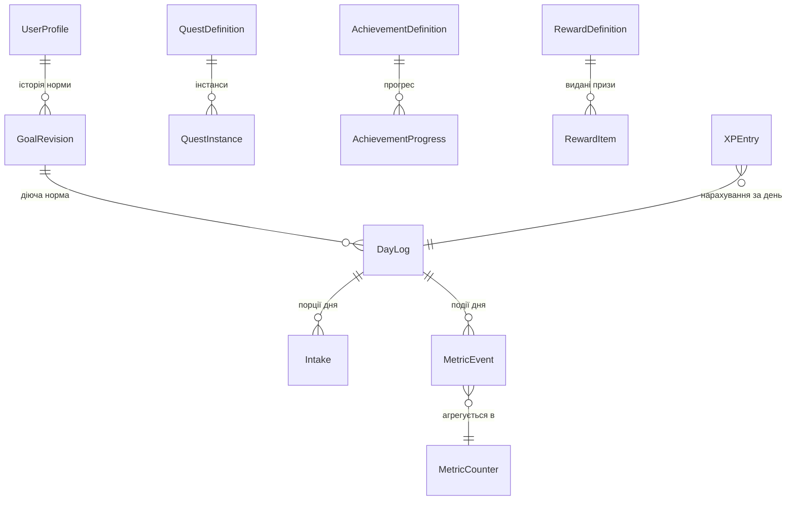

# 🗺️ План розробки iOS-додатку «Трекер води»

Документ описує, **як саме** буде вестися розробка: технічні рішення, архітектура, база даних,
модуль статистики, перенесення макетів і покроковий план з критеріями приймання.

Джерела: `SPEC-TEMPLATE.md` (ТЗ), `WaterTracker.html` (макети), `DESIGN-TOKENS.md` (витяг дизайну).

---

## 0. Мета етапу та межі

**Мета:** зробити повноцінно робочий **каркас** застосунку — модульний, з продуманою БД,
системою збору статистики, дизайн-системою і фундаментом тестів, у який далі легко
довкладати функціонал.

**У межах цього етапу переносимо 4 макети:**

| Макет | Екран | Роль у застосунку |
|---|---|---|
| **1a** | Головний («Сьогодні») | кільце прогресу, швидке додавання, завдання дня, історія + 5 шторок |
| **3f** | Прогрес / профіль | рівень і XP, нагорода за наступний рівень, завдання, призи, досягнення |
| **2e** | Досягнення | категорії + сітка плиток 3×N + модалка деталей |
| **4a** | Норма води / статистика | рівномірність, об'єм по днях, календар-теплокарта, деталі дня, типова доба, теплокарта часу |

**Поза межами етапу (свідомо):** онбординг (макети 5a–5f), сповіщення, віджети, Apple Watch,
HealthKit, монетизація, типи напоїв. Архітектура закладається так, щоб кожне з цього
підключалося окремим модулем без переписування ядра.

---

## 1. Технологічні рішення

| Питання | Рішення | Чому |
|---|---|---|
| Мова / UI | Swift 6, **SwiftUI** | макети — це кастомна графіка й анімації; UIKit тут нічого не дає |
| Мінімальна iOS | **17.0** | `@Observable`, SwiftData, інтерактивні віджети, `ContentUnavailableView`; покриття пристроїв ~95 % |
| Xcode-проєкт | новий, згенерований **XcodeGen** (`project.yml`) | проєкт-файл у Git читабельний, конфлікти в `.pbxproj` не виникають |
| Персистентність | **SwiftData** + шар репозиторіїв (`protocol`) | нативно, без залежностей; репозиторії дають змогу підмінити на GRDB, якщо агрегати стануть важкими |
| Архітектура | модулі — локальні **SPM-пакети**; всередині MVVM (`@Observable` ViewModel) + сервіси | вимога ТЗ про модульність; кожен модуль компілюється й тестується окремо |
| DI | простий контейнер `AppEnvironment` + протоколи на кожен сервіс | тести підставляють fake без магії |
| Залежності | **жодних сторонніх** у ядрі; `swift-snapshot-testing` — лише в тестових таргетах | контроль над бінарником, менше ризиків для App Store |
| Тести | XCTest (unit, per-package) + XCUITest (e2e) + snapshot-тести дизайну | вимога ТЗ «закласти основу для unit та e2e» |
| Локалізація | String Catalog (`.xcstrings`), базова `uk`, потім `en` | плюралізація українською працює з коробки |
| Час/дата | єдиний `Clock`-протокол + `CalendarService` (день починається о 00:00, локальний TZ) | інакше тести на стріки й добові розрізи неможливі |
| Аналітика використання | **немає** на цьому етапі (протокол `AnalyticsSink` — заглушка) | дані лишаються тільки на пристрої, як у ТЗ |

---

## 2. Архітектура модулів

```
WaterTrackerApp (app target)
│
├── Packages/Core            — Clock, CalendarService, Result-типи, DI, Logger, Units (мл ⇄ oz)
├── Packages/Persistence     — SwiftData-схема, репозиторії, міграції, фікстури/сідер
├── Packages/DesignSystem    — токени, шрифти, компоненти, графіки, прев'ю-галерея
├── Packages/Metrics         — шина подій + агрегати (серце статистики)
├── Packages/Hydration       — порції, денна ціль, правило 120 %, undo
├── Packages/Gamification    — XP/рівні, стріки, квести, досягнення, призи (4 незалежні движки)
├── Packages/Insights        — обчислення для 4a: рівномірність, медіана/розкид, теплокарти, тренд
├── Packages/Notifications   — локальні сповіщення: план наперед, журнал, тексти (SPEC-NOTIFICATIONS, WAT-36)
└── Packages/Features        — HomeFeature (1a), ProgressFeature (3f), AchievementsFeature (2e), StatsFeature (4a)
```

Правила залежностей (перевіряються тестом на граф імпортів):

```
Features → (Hydration | Gamification | Insights | Notifications) → Metrics → Persistence → Core
Features → DesignSystem → Core
```

Ніхто не імпортує `Features`; `DesignSystem` не знає про доменні моделі — приймає лише
прості view-моделі (`struct TaskRowModel`, `struct BarModel`…). Це дозволяє
викинути або замінити будь-який модуль гейміфікації без дотику до UI-компонентів.

**Ключ до модульності:** модулі спілкуються не викликами один одного, а через `Metrics` —
`HydrationService` публікує подію, а движки XP/квестів/досягнень на неї реагують.
Додавання нової механіки = новий підписник, без правок у `Hydration`.

---

## 3. Модель даних

### 3.1 Діаграма


```mermaid
erDiagram
    UserProfile ||--o{ GoalRevision : "історія норми"
    DayLog ||--o{ Intake : "порції дня"
    GoalRevision ||--o{ DayLog : "діюча норма"
    DayLog ||--o{ MetricEvent : "події дня"
    MetricEvent }o--|| MetricCounter : "агрегується в"
    QuestDefinition ||--o{ QuestInstance : "інстанси"
    AchievementDefinition ||--o{ AchievementProgress : "прогрес"
    RewardDefinition ||--o{ RewardItem : "видані призи"
    XPEntry }o--|| DayLog : "нарахування за день"
```

### 3.2 Таблиці

**`UserProfile`** (один рядок)
`id, createdAt, gender?, birthYear?, weightKg?, activityLevel, climate, unitSystem (ml|oz),
onboardingCompleted, themeMode (system|light|dark), hapticsEnabled, soundEnabled, locale`
· пропозиція графіка (WAT-41): `scheduleOfferShownAt?, scheduleOfferOutcome (none|accepted|declined|dismissed),
scheduleOfferShiftMinutes` — для правила частоти (SPEC-NOTIFICATIONS §27)
· `dayRhythmEnabled` — «Ритм дня»; вимкнено — режим «просто норма за день» (WAT-42, SPEC-NOTIFICATIONS §28).

**`GoalRevision`** — норма змінюється з часом, статистика має рахуватись за нормою, що діяла тоді
`id, effectiveFrom (date), goalMl, source (calculated|manual), inputsSnapshot (JSON: вага/активність/клімат), createdAt`
· індекс: `effectiveFrom DESC` · правило: мін. 500 / макс. 5000 мл.

**`DayLog`** — денний агрегат (щоб не рахувати графіки по сирих порціях)
`id, dayKey (yyyy-MM-dd, локальний), goalMlSnapshot, wakeMinutesSnapshot?, sleepMinutesSnapshot?, totalMl,
countedMl (з урахуванням стелі 120 %), completionPct, goalMet (bool), entriesCount, firstIntakeAt?, lastIntakeAt?,
timeZoneId, closedAt?`
· унікальний індекс: `dayKey`.

**`Intake`** — порція
`id, dayLogId (FK), amountMl, createdAt, source (app|widget|notification|siri|shortcut), deletedAt?`
· не редагується (ТЗ), видалення — soft-delete, щоб коректно відкотити XP
· обмеження: 50…2000 мл за одну порцію (антифрод/нереалістичний об'єм)
· індекси: `(dayLogId, createdAt DESC)`.

**`MetricEvent`** — сира подія (ядро статистики)
`id, name (enum-key), occurredAt, dayKey, hourBucket (0…23), value (Double), payload (JSON), sourceRef (UUID?)`
· індекси: `(name, dayKey)`, `(dayKey, hourBucket)`.

**`MetricCounter`** — згорнутий агрегат для швидких перевірок
`id, metricKey, periodType (day|week|month|year|all), periodKey, sum, count, min, max, lastUpdatedAt`
· унікальний індекс: `(metricKey, periodType, periodKey)`.

**`StreakState`** (один рядок)
`currentStreak, longestStreak, lastCountedDayKey, frozenDayKeys, lastFreezeUsedDayKey, updatedAt`
· `freezeTokens` лишається в схемі, але з WAT-34 не використовується: готова заморозка — це сам `RewardItem`.

**`XPEntry`** — журнал досвіду (дає чесний undo)
`id, amount, multiplier, reason (intake|questDone|achievement|dailyGoal|partOfDay|prize|streakBonus),
refId (UUID?), dayKey, createdAt, revertedAt?`
· поточні `totalXp` і `level` — обчислювані з журналу + кешуються в `LevelState`.

**`LevelState`** (кеш) `level, totalXp, xpIntoLevel, xpForNextLevel, updatedAt`

**`QuestDefinition`** (каталог у коді/JSON, версіонований)
`key, scope (daily|weekly|adhoc), titleKey, metricKey, comparator, targetValue, rewardXp, rewardKey?, weight, minLevel`

**`QuestInstance`**
`id, defKey, periodKey, target, progress, state (active|completed|expired|claimed), assignedAt, expiresAt, completedAt?`
· унікальний індекс: `(defKey, periodKey)`.

**`AchievementDefinition`** (каталог) `key, titleKey, descKey, category (all|streak|volume|secret), metricKey, target, isSecret, rewardXp, icon`

**`AchievementProgress`** `id, defKey (unique), value, target, unlockedAt?, seenAt?`

**`RewardDefinition`** (каталог) `key, kind (theme|xpBoost|streakFreeze), titleKey, descKey, icon` — у каталозі лише 🧊 `streak.freeze` і ⚡ `xp.double` (SPEC-PRIZES §3)

**`RewardItem`** — видана нагорода / приз
`id, defKey, source (level|quest|achievement|random|seed), acquiredAt, activatedAt?, expiresAt?, state (ready|active|used|expired), seenAt?, usedOnDayKey?`
· прострочення буста похідне від `clock.now`; використані записи не видаляються (на них тримаються `XPEntry` і повернення заморозки).

**`QuickAddPreset`** `id, placeRaw, order, amountMl, enabled` — місце `PresetPlace`: 3 кнопки головного (200/500/1000) + 4 підказки шторки «Інше» (150/250/350/500), редаговані на екрані «Кнопки порцій» (WAT-45). Сід — окремо на місце. Останній об'єм «Інше» — `UserProfile.lastCustomAmountMl`

**`NotificationRule`** (готуємо структуру наперед, UI поки не робимо)
`id, kind (smart|fixed|adaptive|analysis), enabled, weekdayMask, fromHour, toHour, quietRanges (JSON)`

### 3.3 Правила цілісності

- Додавання/видалення порції — **одна транзакція**: `Intake` + перерахунок `DayLog` + `MetricEvent` + `XPEntry`.
- Стеля 120 %: `countedMl = min(totalMl, goal × 1.2)`; `totalMl` зберігає фактичне значення.
- Зміна норми серед дня → нова `GoalRevision`, `DayLog.goalMlSnapshot` оновлюється для **поточного** дня, минулі дні не чіпаються.
- Так само розклад дня (WAT-39): `DayLog.wakeMinutesSnapshot` / `sleepMinutesSnapshot` пишуться з порцією й
  при зміні підйому чи відбою — лише для поточного дня. Цілі частин доби, XP, звіт і графіки читають їх;
  `nil` (історія до WAT-39) — розклад із профілю.
- Ролловер дня о 00:00 локального часу; при зміні TZ день визначається за `timeZoneId`, записаним у `DayLog`.
- Видалення застосунку = втрата даних (тільки on-device, без бекапу) — як у ТЗ.

---

## 4. Модуль статистики (`Metrics`)

Це саме та «система збору статистики, яку легко додати до будь-якого функціоналу», яку вимагає ТЗ.

```swift
// 1. Будь-який модуль публікує подію — і на цьому його обов'язки закінчуються
metrics.record(.init(name: .intakeAdded, value: 300, at: now, payload: ["source": "widget"]))

// 2. Metrics сам: пише MetricEvent → оновлює MetricCounter → шле в шину
// 3. Підписники (XP, квести, досягнення, інсайти) реагують незалежно один від одного
```

**Реєстр метрик** (`MetricKey`) — єдине джерело правди, з якого живляться і завдання, і досягнення, і графіки:

`intake.added`, `intake.removed`, `intake.count`, `day.total`, `day.goalMet`, `day.completionPct`,
`part.morning|noon|day|evening|night`, `streak.current`, `xp.earned`, `level.reached`,
`quest.completed`, `achievement.unlocked`, `app.opened`, `prize.activated`, `reminder.responded`.

Властивості модуля:
- **Ідемпотентність:** подія з тим самим `sourceRef` не подвоює агрегат.
- **Реверс:** `metrics.revert(sourceRef:)` — відкат події і всіх похідних (потрібно для undo порції).
- **Реплей:** агрегати можна перебудувати з `MetricEvent` (`rebuildCounters()`), це ж використовується в тестах.
- **Декларативні правила:** квести й досягнення — це `metricKey + comparator + target`, тобто нова умова додається рядком у каталог, без коду.

---

## 5. Гейміфікація (4 незалежні движки)

| Движок | Відповідальність | Ключове правило |
|---|---|---|
| `XPEngine` | нарахування/відкат XP, рівні | усе через `XPEntry`; рівень = f(totalXp); формула зростання — **`xpToNext(n) = 100 + 50·(n−1)` (лінійна з наростанням)**, винесена в `LevelCurve`-протокол. XP за воду — за зарахований об'єм, не за порцію; баланс — `Config/Balance.xcconfig` (WAT-44, SPEC-PRIZES §16.13) |
| `StreakEngine` | серія днів, множник XP, заморозка | день зараховується при 100 % норми; заморозка витрачає `RewardItem(kind: .streakFreeze)` |
| `QuestEngine` | видача/прогрес/закриття завдань | інстанси на `periodKey`; прогрес — читання `MetricCounter` |
| `AchievementEngine` | розблокування досягнень | те саме джерело метрик; секретні — прапорець `isSecret` |

**Відкат дії (питання з ТЗ, розділ 5.2).** Пропоноване рішення: **повний реверс** —
видалення порції відкочує XP, знімає квест у стан `active` і знімає досягнення,
якщо воно розблокувалось саме цією подією (`XPEntry.refId` / `AchievementProgress.unlockedAt` порівнюються з `sourceRef`).
Виняток: якщо після відкату умова все одно виконана з інших даних — досягнення лишається.
Це чесно і не дає «фармити» видаленням. Рішення інкапсульоване в `RevertPolicy` — змінити його потім = один файл.

---

## 6. Перенесення макетів: метод

1. **Токени.** Спершу `DesignSystem` (див. `DESIGN-TOKENS.md`) — кольори, шрифти, радіуси, тіні, анімації.
   Шрифти Fredoka + Nunito бандлимо (OFL), реєструємо через `UIAppFonts`.
2. **Компоненти.** Кожен елемент з інвентарю — окремий `View` з `#Preview` (light + dark).
3. **Екрани.** Складання екрана з готових компонентів; жодних «магічних чисел» у Feature-шарі —
   тільки токени й компоненти.
4. **Дизайн-QA.** Окремий debug-таргет `DesignGallery`: рендерить кожен екран з тими самими
   фікстурами, що в макеті (ml = 1250, goal = 2000, streak = 12, level = 7, xp = 320/500,
   історія 300/200/500/250, липень 2026, сьогодні = 18). Порівняння скріншот-у-скріншот з HTML
   при ширині 402 pt. Розбіжність > 1 pt у розмірі/відступі — баг.
5. **Snapshot-тести** фіксують результат, щоб дизайн не «поплив» при рефакторингу.

**Точність:** макети зроблені в кадрі 402 × 874 pt, тому всі числа з HTML переносяться 1:1.
Динамічний шрифт обмежуємо (`.dynamicTypeSize(...DeviceSize.accessibility1)`) — інакше макет ламається;
повну підтримку Dynamic Type виносимо в окрему задачу після MVP.

---

## 7. Екрани: розбір і джерела даних

### 7.1 Макет 1a — Головний

| Блок | Компонент | Дані | Дія |
|---|---|---|---|
| Хедер: шестерня | `WTCircleButton` 42 | — | шторка «Налаштування» |
| Хедер: 7 крапок | розмітка в `HomeScreen` | `DayLog` за вікно `slidingWindow(7)` | (тап → шторка стріку/календаря); від серії 7 — `WTStreakDrop` замість крапок |
| Хедер: крапля з рівнем | `LevelDropIcon` + бейдж | `LevelState`, `hasNewAch` | перехід на **3f** |
| Кільце 242 pt | `ProgressRing` | `DayLog.countedMl / goal` | — |
| Капсула частини доби | `WTDayPartPill` | `PaceCurve.dayPartProgress` за розкладом дня, порції сьогодні (WAT-40, SPEC-NOTIFICATIONS §26); у режимі «просто норма» — немає | — |
| 4 кнопки | `QuickAddGrid` | `QuickAddPreset` | +200 / +500 / +1000 / шторка «Інше» |
| Завдання на сьогодні | `TaskRow` × N | `QuestInstance(scope: .daily)` | — |
| Історія | `HistoryTimelineRow` × N | `Intake` за день | тап → розкрити «Видалити» |
| Шторка «Інше» | `WTSheet` | крок 50, чіпи 150/250/350/500 | додати порцію |
| Шторка календаря | `WTSheet` | `DayLog` місяця, `streak` | — |
| Екран «Налаштування» | `SettingsScreen` у стеку навігації (WAT-15): картки «Вода», «Ритм і нагадування», «Застосунок» | ціль (крок 250), кнопки порцій → екран «Кнопки порцій» (WAT-45), «Ритм дня» (WAT-42), нагадування → екран «Сповіщення», вібрація, темна тема | вимикання ритму разово пропонує «Рівні інтервали»; «назад» з «Сповіщень» вертає сюди |
| Екран «Кнопки порцій» | `PortionButtonsScreen` у стеку (WAT-45) | 3 кнопки головного + 4 підказки шторки «Інше», степер ±50 мл до 1 л і ±100 мл від 1 л (`PresetRules.stepped`, дублі дозволені), підпис `HomeScreen.amountTitle` (до 1 л — мл), «Повернути типові» | головний перечитує кнопки в `onAppear` |
| Шторка статистики | `WTSheet` | 7 днів + середнє/найкращий/разом | — |
| Вікно «Графік дня» | `ScheduleScreen` на весь екран: `WTGlyphBadge`, `WTTimeChange`, `WTTimeStepper` | `Insights.scheduleSuggestion()` за 14 днів + `ScheduleOfferPolicy` (WAT-41, SPEC-NOTIFICATIONS §27) | змінити розклад / підправити кроками / «Ні» |

Тема перемикається тут же (`themeMode`) — обидві палітри вже є в макеті.

### 7.2 Макет 3f — Прогрес

Донат рівня (тап → вікно «Шлях рівнів» на весь екран, WAT-44; крапка «нове», поки вибір чи 🎁 чекають)
→ блок «НАГОРОДА НА РІВНІ N» (або заклик «РІВЕНЬ N · ЧЕКАЄ НА ТЕБЕ»)
→ «ЗАВДАННЯ» (сьогодні / цього тижня) → «ПРИЗИ» (стоси, дія — у картці) → «ДОСЯГНЕННЯ» —
вітрина до 4×2 (лише відкриті й ті, що в процесі), тап по бейджу → картка деталей, «Всі» → **2e**.
Дані: `LevelState`, `XPEntry`, `QuestInstance`, `RewardItem`, `AchievementProgress`, `RewardDefinition`.

### 7.3 Макет 2e — Досягнення

Лічильник «ВІДКРИТО / N / M» → один ряд фільтрів (чипи стану + меню категорій від кнопки)
→ сітка плиток 3×N (закриті — з прогрес-баром і `val/target`) → картка деталей `WTAchievementDetail`.
Реалізовано за ТЗ у WAT-23.

Детальне ТЗ модуля (два фільтри, сортування, секретні, картка деталей, порожні стани,
доступність, перелік змін у коді) — **`SPEC-ACHIEVEMENTS.md`**, макет — `Design/Achievements.html`.

### 7.3a Модуль «Призи» (WAT-26 → реалізовано в WAT-34)

До WAT-34 блок «ПРИЗИ» працював лише формально: 3 з 5 призів після «Активувати» нічого не роблять,
а заморозка серії ніколи не витрачається (`StreakEngine.useFreeze` без викликів). ТЗ переробляє
модуль: приз — предмет із дією; у каталозі 🧊 заморозка серії й ⚡ подвійний XP до кінця доби.
Показуються лише отримані й не використані призи (діючий — статусом у заголовку блоку на 3f і hero-карткою на екрані «Призи», однакові — стосом «×N»),
історії немає; новий екран «Призи» (Діє зараз / Готові); дія — лише в картці призу; кнопка
заморозки — «вчора» чи «сьогодні» за правилом §6.2. Головний екран не змінюється.
Детально — **`SPEC-PRIZES.md`**, макет — `Design/Prizes.html`.

**Шлях рівнів (WAT-44, SPEC-PRIZES §16).** Шторку «Нагороди за рівні» замінило вікно на весь екран — «Драбина»:
рейка рівнів зліва, картки призів справа; відкривається вже прокрученим до призу, що чекає дії, або до
останнього отриманого. Вузли рівнів — декларативний `LevelRoadCatalog`: до 10-го рівня приз через рівень,
з 11-го — на кожному; бувають звичайний приз, вибір «один з двох» і таємний 🎁 (вміст наперед визначений
`MysteryRoll`, розкриття «Скриня»). Наперед видно 3 призи й 2 у тумані. Новий приз 🌟 «Потрійний XP» — лише з 🎁.
XP за воду — за зарахований об'єм у межах стелі 120 %, баланс — `Config/Balance.xcconfig`; довідник «Звідки XP» —
за «?» у вікні. Макет — `Design/LevelRoad.html`.

### 7.4 Макет 4a — Норма води / Статистика

| Блок | Обчислення (модуль `Insights`) |
|---|---|
| «Рівномірність за день», бал 0–100 | 5 частин доби; смуга = випито, ризка = шматок кривої темпу дня (`PaceCurve.partTargetsMl`, поза активними годинами — без ризки); бал — нормована відстань від часток тієї ж кривої (WAT-39, SPEC-NOTIFICATIONS §25) |
| «Об'єм по днях» (7 днів / 8 тижнів) | суми `DayLog`, пунктир цілі, автомасштаб від `max(значення, ціль)` |
| «Календар пиття» | теплокарта % норми, галочка при ≥ 100 %, свайп ±1 місяць, межа — місяць встановлення |
| Деталі обраного дня | ритм по 5 частинах доби + список внесень (без видалення) |
| «Типова доба — медіана і розкид» | перемикач 7 / 30 днів; медіана частки періоду, міжквартильний розкид, ризка цілі + інфо-модалка |
| «Коли ти п'єш» | теплокарта 7 днів × 9 годинних бакетів (6…22), 5 рівнів інтенсивності |
| Шторка «Розрахунок норми» | вага (крок 1 кг), активність (3), клімат (2) → рекомендована норма → «Застосувати» |

---

## 8. Навігація

`NavigationStack` + власні шторки (не системні — макет має нестандартні радіус/тінь/анімацію).

```
Home (1a)
 ├─ шестерня        → шторка Налаштування
 ├─ крапля з рівнем → Progress (3f) ─ «Всі» → Achievements (2e)
 │                                  └ тап по донату / блоку нагороди → вікно «Шлях рівнів» (на весь екран)
 ├─ тап по кільцю   → Stats (4a) ─ шторка «Розрахунок норми»
 └─ відкриття застосунку → вікно «Графік дня», якщо звичка стабільно відходить від графіка (WAT-41)

Сповіщення (SPEC-NOTIFICATIONS §16.4)
 ├─ ранкова склянка        → Home + вікно «Склянка» на весь екран
 ├─ нагадування, чекпоінт  → Home + шторка «Інше»
 ├─ порятунок серії        → «Призи» з карткою заморозки
 └─ звіт                   → «Звіт» (історія; злитий тиждень + місяць — підряд)
```

⚠️ Два переходи в макетах не мають явної кнопки — вони **дораховані** мною (позначено як припущення в §12):
вхід на **4a** (пропоную тап по кільцю прогресу) і виклик шторки «Розрахунок норми» на 4a
(пропоную рядок «Розрахувати норму» в налаштуваннях + кнопку в шапці 4a).
Таб-бару в макетах немає — навігацію лишаємо стековою.

---

## 9. Тести

| Рівень | Що покриваємо | Де |
|---|---|---|
| Unit — домен | формула норми, стеля 120 %, ролловер дня, зміна TZ, стріки й заморозка, XP + відкат, прогрес квестів і досягнень, ідемпотентність метрик | `Packages/*/Tests` |
| Unit — обчислення | бал рівномірності, медіана/розкид, бакети теплокарти, масштабування графіків, порожні дані | `InsightsTests` |
| Unit — БД | міграції, унікальні індекси, транзакційність «додав/видалив порцію», `rebuildCounters()` | `PersistenceTests` |
| Snapshot | усі компоненти + 4 екрани, light + dark, 402 × 874 | `DesignSystemTests` |
| E2E (XCUITest) | сценарії: додав 200 мл → % змінився → зʼявився в історії → видалив → % відкотився; виконання завдання → +XP; перехід 1a → 3f → 2e; перемикання теми; перегляд 4a з фікстурним місяцем | `WaterTrackerUITests` |

**Керованість тестів:** застосунок стартує з `--uitest-fixture <name>` — сідер наливає детерміновану БД
в in-memory сторі, `Clock` підмінюється фіксованою датою (18 липня 2026). Без цього e2e буде «плаваючим».

---

## 10. Етапи розробки

| # | Етап | Результат | Критерій приймання | Оцінка |
|---|---|---|---|---|
| **0** | Каркас проєкту | XcodeGen-проєкт, 8 SPM-пакетів, порожні тест-таргети, `Makefile` (build/test/lint), SwiftLint | `make test` зелений на порожніх тестах; граф залежностей відповідає §2 | 1 д |
| **1** | Дизайн-система | токени, шрифти, ~25 компонентів, `DesignGallery` | усі компоненти мають прев'ю light+dark; snapshot-база зафіксована | 3–4 д |
| **2** | Дані | SwiftData-схема §3, репозиторії, сідер, фікстури | unit-тести БД зелені; фікстура «липень 2026» наливається | 2–3 д |
| **3** | Metrics | події, лічильники, шина, revert + replay | тести на ідемпотентність і відкат; `rebuildCounters()` дає той самий результат | 2 д |
| **4** | Екран 1a | головний екран + 5 шторок, реальне додавання/видалення порцій | e2e «додав/видалив»; піксельне звіряння з макетом | 4–5 д |
| **5** | Гейміфікація | XPEngine, StreakEngine, QuestEngine, AchievementEngine + каталоги | тести правил і відкату; завдання на 1a живі | 3–4 д |
| **6** | Екран 3f | прогрес, призи, нагороди за рівні | звіряння з макетом; перехід на 2e | 2–3 д |
| **7** | Екран 2e | досягнення, категорії, модалка | звіряння; фільтри працюють на реальних даних | 1–2 д |
| **8** | Insights + екран 4a | усі 6 блоків статистики + шторка розрахунку | тести обчислень; звіряння; коректна поведінка на порожніх даних | 4–5 д |
| **9** | Зшивання й полірування | навігація, темна тема для 2e/3f/4a, локалізація `uk`, гаптика, порожні стани, продуктивність | e2e-набір зелений; немає хардкоду рядків; 60 fps на анімаціях | 2–3 д |

**Разом: ≈ 24–32 робочих дні** до готового каркаса з 4 екранами.

Далі (окремими етапами, поза цим планом): онбординг 5a–5f → сповіщення → віджети → Apple Watch.


---

## 🚦 Статус виконання (оновлено 25.08.2026)

| # | Етап | Стан | Що зроблено |
|---|---|---|---|
| **0** | Каркас проєкту | ✅ | XcodeGen (`project.yml`), 8 SPM-пакетів, `Makefile`, e2e-таргет |
| **1** | Дизайн-система | ✅ | токени, типографіка, 25+ компонентів, графіки, 7 тестів палітри |
| **2** | Дані | ✅ | 14 таблиць SwiftData, репозиторії, 12 тестів |
| **3** | Metrics | ✅ | події, лічильники, шина, revert + rebuild, 9 тестів |
| **4** | Екран 1a | ✅ | головний екран + 5 шторок, реальні порції й undo |
| **5** | Гейміфікація | ✅ | XP/рівні/серії/квести/досягнення/призи, 29 тестів |
| **6** | Екран 3f | ✅ | прогрес, нагороди рівнів, призи, досягнення |
| **6a** | Модуль «Призи» | ✅ | заморозка серії й подвійний XP, блок 3f, екран «Призи», картка з дією (WAT-34) |
| **7** | Екран 2e | ✅ | лічильник, фільтри стану й категорії, сітка 3×N, картка деталей, тост розблокування (WAT-23) |
| **8** | Insights + 4a | ✅ | 6 блоків статистики + калькулятор норми, 12 тестів |
| **9** | Зшивання й полірування | 🟡 | навігація, теми й e2e готові; лишились шрифти, локалізація в каталог |
| **10** | Відчуття та відгук | ✅ | гаптика з вимикачем, стани натискання, анімовані шторки + drag-to-dismiss, тост із «Скасувати» й тост рівня, пояснення стелі 120 %, Reduce Motion |
| **11** | Сповіщення, етапи 0 + A | ✅ | поточний пояс і повернення з фону; пакет `Notifications` (крива темпу, планувальник, журнал, тексти); типи 1, 2, 3, 7, 8, 9; дії й переходи; анти-спам; дозвіл; нагороди за повернення; екран «Сповіщення» (WAT-36). Етапи B і C — WAT-37, WAT-38 |
| **12** | Сповіщення, етап B | ✅ | цілі частин доби (`GoalBlock`) і XP за них; тип 4 — чекпоінти, злиті з нагадуванням; тип 6 — звіти дня, тижня й місяця (тихий денний, злиття тижня й місяця); вікно «Склянка»; екран «Звіт» — історія-інфографіка; рядки B на екрані «Сповіщення»; макет `Design/Notifications.html` (WAT-37). Етап C — WAT-38 |

| **13** | Пропозиція графіка дня | ✅ | `Insights.ScheduleShift` — зсув за 14 днів в обидва боки, будні й вихідні окремо; правило частоти; вікно «Графік дня» на чистому відкритті головного; макет `Design/Schedule.html` (WAT-41, SPEC-NOTIFICATIONS §27) |
| **14** | Перемикач «Ритм дня» | ✅ | режим «просто норма за день»: без чекпоінтів, XP `dayPartGoal`, завдань на частини доби, капсули й частин у звітах; рядок на екрані «Налаштування» (WAT-42, SPEC-NOTIFICATIONS §28; екран — WAT-15) |
| **15** | Спад кривої темпу перед сном | ✅ | останні 2 год до відбою — половинний темп (`PaceCurve.taperMinutes`, `taperFactor`); цілі частин 689 / 826 / 485; оновлено таблиці §4, §6.1, §6.3 і всі похідні (WAT-43, SPEC-NOTIFICATIONS §29) |
| **16** | Шлях рівнів | ✅ | вікно на весь екран «Драбина» з фокусом на призі; вузли «вибір» і таємний 🎁 («Скриня»); рідші призи до 10-го рівня; горизонт 3 + 2 у тумані; 🌟 «Потрійний XP»; XP за об'єм і баланс у `Config/Balance.xcconfig`; довідник «Звідки XP»; призи у звіті місяця (WAT-44, SPEC-PRIZES §16) |
| **17** | Кнопки порцій | ✅ | свої кнопки головного й підказки шторки «Інше» на екрані «Кнопки порцій»; шторка «Інше» з останнім об'ємом (WAT-45, SPEC-TEMPLATE §4.1) |

**Тести:** 500 unit (9 пакетів) + 41 e2e у симуляторі — усі зелені.
`make test-packages` — швидкий цикл без симулятора, `make test-ui` — e2e.

### Що з'ясувалося під час реалізації

1. **Продуктивність.** Перша версія витрачала 45 мс на одну порцію: `LevelState` перечитувався з
   усього журналу XP, а лічильники метрик — з БД по 40 вибірок на дію. Додано кеш рівня,
   лічильників, рядків досягнень і квестів + збереження контексту раз на дію (`metrics.commit()`).
   Стало **9 мс** — тест `PerformanceTests` тримає межу.
2. **Максимум лічильника не відкочується арифметично.** Досягнення «Великий ковток» (1 л за раз)
   лишалося відкритим після видалення тієї самої порції. Тепер `min`/`max` перечитуються з подій
   при відкаті.
3. **Рівні не видавали призи.** Каталог нагород був, але інвентар лишався порожнім —
   додано `grantLevelRewards` з ідемпотентною видачею за детермінованим ключем.
4. **Ідентифікатор доступності на контейнері перекриває дочірні.** Через це шторки були
   недосяжні для e2e: усі елементи успадковували `screen.home`. Ідентифікатори лишились
   тільки на конкретних елементах. *(Та сама пастка вдруге спрацювала на тості
   в етапі 10 — тепер про це є коментар у `WTToast`.)*

5. **`xcodebuild` писав збірку не туди, куди всі думали.** `make build` без
   `-derivedDataPath` кладе продукт у `~/Library/Developer/Xcode/DerivedData`, а тека
   `DerivedData/` у проєкті лишалась зі старою збіркою. Будь-який
   `find DerivedData -name '*.app'` віддавав дводенний бінарник, і в симулятор їхав код,
   якого в репозиторії вже не було. Через це «перевірка руками» показувала застосунок
   без щойно доданих можливостей, тоді як e2e (який будує сам) був зелений — і виглядало
   це як регресія в коді. Тепер `build` і `test-ui` пінять `-derivedDataPath DerivedData`,
   а `make install` ставить у симулятор саме той продукт.

6. **`waitForExistence` не є перевіркою видимості.** Він підтверджує лише наявність
   елемента в дереві доступності. Тост, застряглий за межею екрана, лишив би тест зеленим.
   У сценарії зі скасуванням додано `isHittable` і перевірку, що елемент у межах вікна.

7. **Шар відгуку був відсутній як клас.** Грепом по всьому дереву: нуль `sensoryFeedback`,
   два `withAnimation` на застосунок, нуль кастомних `ButtonStyle`, а токен `WTAnimation.sheet`
   не використовувався **жодного разу** — шторки мали `.transition`, але присвоєння
   `model.sheet = …` йшло повз `withAnimation`, тож перехід не програвався ніколи.

8. **Норма й новий рівень закриваються тією самою порцією.** Виконання норми дає більшість
   денного XP, тож ці дві події майже завжди збігаються. Візуального святкування норми немає
   (пробували — перевантажувало момент), лишились вібрація `.goalReached` і тост про рівень.

9. **`String.hashValue` не детермінований між запусками процесу.** `FixtureSeeder`
   вибирав патерн дня як `abs(dayKey.rawValue.hashValue) % …`, а Swift засіває хешування
   рядків випадково при старті процесу (якщо не виставлено `SWIFT_DETERMINISTIC_HASHING`).
   Доккоментар обіцяв «детерміновані демо-дані», але три однакові прогони з тим самим
   `FixedClock` давали серії 0, 2 і 1: скріншоти для дизайн-QA не збігалися між собою,
   e2e на вміст демо-історії були приречені плавати, а різні числа серії в шапці (8 і 9)
   породили хибний баг-репорт. Замінено на власний FNV-1a (`FixtureSeeder.stableHash`).
   Пропуск дня і вибір патерну тепер беруться з різних половин хешу — спільне джерело
   остач корелювало (9 і 6 мають дільник 3) і перекошувало частку днів із закритою нормою.
   Тест на дві бази в одному процесі таку регресію **не ловить** (усередині процесу
   `hashValue` стабільний), тому `FixtureSeederTests` прибиває самі числа хешу.

10. **Заморозка серії існувала лише на папері (WAT-34).** Приз «активувався» у жетон
    `freezeTokens`, який ніхто не читав, а `useFreeze` не мав жодного виклику. Два шари для
    однієї сутності прибрано: предмет в інвентарі і є жетон, `useFreeze(prizeId:)` сам обирає
    день за правилом `StreakEngine.freezeTarget` (SPEC-PRIZES §6.2, дослівно в doc-коментарі).
    Заодно заморожені дні перестали **додавати** до серії — вони лише тримають ланцюг,
    а заморожений день, який потім закрили, повертає приз в інвентар.
11. **Повернута заморозка не могла б спрацювати вдруге.** Шина метрик ідемпотентна за
    `name + sourceRef`, а `prize.activated` пишеться з `sourceRef = id предмета`. Тож при
    поверненні призу метрика активації відкочується — інакше повторне використання того
    самого предмета мовчки не лягло б у статистику.

12. **Пояс доби застигав на старті.** `CalendarService` записував пояс у `init`, а `AppServices`
    створює його один раз — після перельоту ключі доби рахувались у старому поясі до перезапуску.
    Тепер календар перебудовується зі спільного кешу, коли змінився пояс годинника; копії
    структури в Hydration і Gamification переходять разом з оригіналом (тест на копію є).
13. **Гейміфікація реагувала на кожну метрику.** `metricsDidRecord` проганяє квести й досягнення
    для всього, чого немає в `internalMetrics`. Метрика «сповіщення доставлено» пишеться на кожне
    перепланування — без додавання в список кожна позначка створювала б і перевіряла квести.
14. **`UNUserNotificationCenter.current()` падає в SPM-тестах** (немає бандла). Тому центр закритий
    протоколом, а справжній створюється лише в застосунку. Той самий фейковий центр прибрав
    системні діалоги з e2e: дозвіл задає прапорець.
15. **Відкладене перепланування могло не встигнути.** Перепланування асинхронне й іде після дії, а
    застосунок, згорнутий одразу після порції, iOS призупиняє — і доставились би старі нагадування.
    При переході у фон план перераховується синхронно в `beginBackgroundTask`.
16. **Подарунок за повернення спрацював «вживу».** На ручній перевірці в симуляторі після кількох
    днів без порцій дія «+250 мл» з тестового сповіщення у фоні додала порцію, видала ⚡ і
    відлуння «🎁 З поверненням!» — увесь ланцюжок §12.5 + тип 8 без відкриття застосунку.

17. **`DayLog.partTotals` не годиться для цілей частин доби (WAT-37).** Ніч у ньому одним числом, а при
    підйомі до 05:00 і відбої після 22:00 вона лежить на обох кінцях доби: порція о 23:00 зараховувалась би
    ранковій цілі. Випите в частині рахується за часом порцій (`GoalBlock.drunkMl`) — однаково для
    чекпоінта, XP і звіту.
18. **`PerformanceTests` не бачили нового шляху порції.** `GameEnv.addIntakeEvent` пише лише події, без
    денного логу, — XP за частину доби, що читає порції дня, там просто виходив раніше. Доданий сценарій
    зі справжніми порціями (`testBulkIntakeWithDayLogs`): новий шлях коштує ≈ 1,5 мс на порцію.
19. **`LazyVGrid` з кількома `ForEach` і однаковими ідентифікаторами зливає комірки.** Мозаїка місяця в
    звіті мала три групи з id 0…6 (назви днів, порожні клітинки, дні) — і перший тиждень місяця зникав.
    Кожна група має власний простір ідентифікаторів.
20. **Склянка о 06:30 при підйомі о 08:00 не зараховувалась ранку (WAT-39).** `GoalBlock` рахував лише
    порції в межах розкладу; денну норму вони поповнювали, а чекпоінт, XP і ✓ звіту їх не бачили. Тепер
    порція до підйому — першому блоку, після відбою — останньому; межі цілі не змінились. Заодно звіт за
    минулі дні перестав залежати від поточного розкладу (знімок у `DayLog`), а графіки 4a — від фіксованих
    20/20/30/22/8 % (SPEC-NOTIFICATIONS §25).
21. **Демо-історія могла б сама запропонувати графік (WAT-41).** Патерн дня в `FixtureSeeder` залежить від
    дати, а e2e біжать на справжньому годиннику: у якийсь із днів 14-денне вікно склалося б у зсув, і вікно
    «Графік дня» перекрило б чужий сценарій. Демо-історія вважається такою, що вже відповіла «Так»; саме
    вікно — `--start-screen schedule-suggestion`, справжній шлях — `--seed-schedule-shift`.
22. **«→» у Nunito немає.** Система підставляла тонку стрілку з іншого шрифту — у вікні «Графік дня» стрілка
    тепер SF Symbol `arrow.right`.
23. **«Випити воду зранку» ніколи не видається (виявлено в WAT-42).** Завдання третє в `QuestCatalog.daily`, а
    `dailySlots = 2` бере перші два — «норму» й «4 записи». Через це й вставка «ранкове завдання» в тексті
    ранкової склянки (`QuestHints.morningQuestActive`) не спрацьовує. Чи ротувати пул — окреме продуктове
    рішення; правило «без ритму дня — без завдань на частини доби» вже стоїть у `QuestEngine.ensureInstances`.
24. **Спад перед сном не можна робити окремим відрізком кривої (WAT-43).** `goalBlocks()` будує блоки з
    `PaceCurve.segments`, і вечір 20–22 (рівно 120 хв, не коротший за `minGoalBlockMinutes`) став би
    окремою ціллю з чекпоінтом «до 20:00». Відрізки лишились по одному на частину доби, а лінійні шматки
    зі спадом — у приватних `pieces`, по яких рахуються `E(t)` і `minute(reaching:)`.

25. **Нескінченна анімація через `withAnimation(.repeatForever)` «пливе» чужими вʼюхами (WAT-44).** Похитування 🎁
    і обертання променів «Скрині» вмикались так в `onAppear` — і транзакція підхоплювала зсуви інших вʼюх:
    шапка вікна «Шлях рівнів» їздила під статус-бар. Безкінечний рух — лише від часу (`TimelineView`), як
    у `WTBubbles`.
26. **Маска на `ZStack` променів обрізала їх до рамки одного променя.** Рамка `ZStack` — це розмір дочірньої
    капсули (22 × 150); маска лягала на неї, і від 12 променів лишався один. Спершу `frame`, потім `mask`.
27. **XP за порцію заохочував дрібнити воду (WAT-44).** 40 порцій по 50 мл давали 200 XP, а понад стелю 120 % —
    так само. Тепер XP — приріст ⌊k · зараховане⌋ за день: п'ять порцій по 50 мл = одна на 250, понад стелю — 0.
    `GameEnv.addIntakeEvent` у тестах тепер веде й денний лог: без нього XP за воду був би нульовим.

### Свідомі відхилення від макета

| Що | Як у макеті | Як зроблено | Чому |
|---|---|---|---|
| Шрифти | «Fredoka» на заголовках | Nunito на весь текст, Fredoka лише на числах | у макеті Fredoka підключена **без кирилиці** — український текст там і так рендериться Nunito (рішення 25.08.2026: гарнітури завантажено з Google Fonts і додано в бандл) |
| Розрахунок норми (шторка 4a) | є в макеті, без тригера | винесено у `GoalCalculatorSheet.swift`, не підключено | рішення 25.08.2026: норма змінюється лише в налаштуваннях, формула — пізніше. Верстка й доменна логіка (`GoalFormula`) збережені та покриті тестами |
| Ризка «ціль» у «Рівномірності» й «Типовій добі» | однакова для всіх рядків (норма ÷ 5) | шматок кривої темпу дня в межах активних годин; ніч поза ними — без ризки | рішення 05.10.2026 (WAT-39): графік оцінює день так само, як звіт, XP і чекпоінт; рівний поділ (а потім фіксовані 20/20/30/22/8 %) ставив ціль на ніч і давав ранку 08–09 повні 20 % |
| Бал рівномірності | зашите число 47 | формула `100 × (1 − ½·Σ\|факт − ціль\|)` з частками кривої дня | у макеті це демо-значення, формули не було |
| Дані макетів (рівень 7, стрік 12) | зашиті | обчислюються з реальної історії | цифри тепер походять з БД, а не з констант |

### Наступні кроки

1. ~~Зміна доби при поверненні з фону~~ — ✅ WAT-36 (`scenePhase` → `handleBecameActive`).
2. ~~`services.revision`~~ — ✅ WAT-36: прибрано; сигнал для екранів — `services.epoch`.
3. **VoiceOver:** покриття нульове (є лише `accessibilityIdentifier` для e2e) — потрібні
   `accessibilityLabel` / `accessibilityValue` для кільця, кнопок, історії, календаря.
4. Локалізація: винести рядки в `.xcstrings` (зараз — у коді, українською).
5. Звуки (`soundEnabled` у профілі теж поки без керування).
6. Далі за планом: онбординг 5a–5f → віджети. Сповіщення: етапи 0 і A — ✅ WAT-36; етап B
   (вікно «Склянка», звіти, чекпоінти, рядки B на екрані «Сповіщення») — ✅ WAT-37; повний редизайн
   екрана «Сповіщення» — WAT-18 (окремий екран налаштувань уже є — WAT-15); етап C (несподівані завдання, `weakDayPart` уже є) —
   WAT-38; ассет звуку «булькання» — окрема задача. Віджети (WAT-30) мають після
   порції викликати те саме перепланування (`services.touch()`). Що має питати онбординг заради
   сповіщень — SPEC-NOTIFICATIONS §21.
7. Коли дійде черга до формули норми — увімкнути `GoalCalculatorSheet` (один рядок на екрані 4a).
8. **Призи — відкриті питання** `SPEC-PRIZES.md` §13: призи за завдання й випадкові (за несподівані
   завдання вирішено — SPEC-NOTIFICATIONS §10.2), тема-приз
   (палітра «Океан»), «Знавець гідратації» як досягнення, заморозка «сьогодні» без серії. Ліміт заморозок
   вирішено вибором (WAT-44). Відкладене з WAT-44 — SPEC-PRIZES §16.11: гарантія 🌟, «≈ через 2 дні»,
   назви розділів, колекція склянок, тижнева скриня. Баланс XP і призів — окремою задачею, через
   `Config/Balance.xcconfig`.
9. ~~`CalendarService` фіксує часовий пояс у `init`~~ — ✅ WAT-36.

---

## 11. Ризики

| Ризик | Пом'якшення |
|---|---|
| Агрегати статистики стануть повільними на SwiftData | усі запити — через репозиторій; `MetricCounter` знімає більшість читань; за потреби заміна на GRDB без дотику до Features |
| Темна тема для 3 екранів не намальована | виводимо з токенів 1a і затверджуємо окремим прев'ю-проходом до початку Фази 6 |
| Розходження формул норми (ТЗ vs макет) | `GoalFormula`-протокол з двома реалізаціями; фінальна обирається твоїм рішенням (див. §13) |
| Дизайн «попливе» при рефакторингу | snapshot-тести + заборона магічних чисел поза `DesignSystem` |
| Правила відкату XP/досягнень виявляться незручними | ізольовані в `RevertPolicy`, змінюються в одному місці |

---

## 12. Припущення, які я зробив (можеш перевизначити)

1. **Мінімальна iOS — 17.0**; орієнтація тільки портретна.
2. **Вхід на 4a** — тап по кільцю прогресу; **шторка «Розрахунок норми»** викликається з налаштувань і з шапки 4a (у макетах тригерів немає).
3. **Крива рівнів** — `xpToNext(n) = 100 + 50·(n−1)`, рівнів необмежено.
4. **Відкат дії** — повний реверс XP/квестів/досягнень, окрім випадку, коли умова лишається виконаною з інших даних.
5. **Ліміт однієї порції** — 50…2000 мл; денна ціль — 500…5000 мл (як у макетах).
6. **Стеля обліку** — 120 % норми, кнопки не блокуємо (тільки перестає рости зарахований обсяг).
7. **Частини доби** — Ранок / Полудень / День / Вечір / Ніч, як у макеті 4a; конкретні межі годин зафіксуємо у `DayPart` (за замовчуванням 5–9 / 9–12 / 12–17 / 17–22 / 22–5).
8. **Дизайн-система — джерело правди** для всіх майбутніх екранів, включно з онбордингом.

## 13. Питання, на які потрібна твоя відповідь (не блокують старт — впливають на Фази 5 і 8)

1. ~~**Формула норми**~~ — ✅ закрито 25.08.2026: поки без формули, норма змінюється лише
   в налаштуваннях. Обидві реалізації (`SpecGoalFormula`, `MockupGoalFormula`) лишаються
   в пакеті `Hydration` з тестами й вмикаються, коли дійде черга.
   Відповідь: на даному етапі не роби автоматичний розраунок норми і онборднг. Пізніше я це додам.
2. **Скільки XP** за: порцію / закриття норми / закриття частини доби / щоденне завдання / тижневий челендж?
   Можу запропонувати збалансовану стартову таблицю — тоді ти її просто підтвердиш.
   Відповідь: Так давай зараз твій варіант, а потім я відкалібрую
3. **Назва застосунку** і bundle ID — потрібні на Фазі 0 (тимчасово поставлю `WaterTracker` / `com.watertracker.app`).
Відповідь: поки став так, а потім поміняємо
